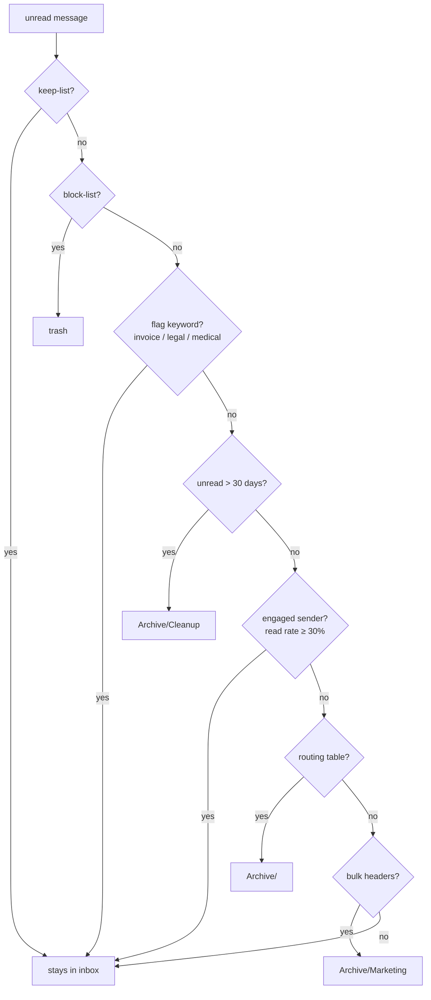

# gmail-cleanup

[](https://github.com/noahfoster2174/gmail-inbox-automation/actions/workflows/ci.yml)

Evidence-based Gmail inbox automation. It archives what you never read, protects what you do,
blocks what you never asked for, and refuses to take irreversible actions without approval —
all decided from your own engagement history rather than hardcoded guesses.

Built as a personal tool, hardened like production software: 78 tests, CI, a pure decision
core, an audit trail, and a set of safety mechanisms that each exist because something real
went wrong without them. The full story is in the [design whitepaper](docs/DESIGN.md).

## How it decides

Every unread inbox message flows through an ordered gauntlet — first gate to claim it wins:



The engagement gate has one deliberate exception: senders in the notification tier
(receipts, statements, shipping) are archived even when read — the app already notified
you; the email is just the record.

## What it will not do

- **Send unsubscribe requests without approval.** The weekly job only *builds* a candidate
  list; a separate `unsubscribe-send` command shows it and asks before anything leaves.
- **Touch keep-listed senders.** The keep-list beats every other mechanism, including the
  block-list.
- **Count its own actions as your engagement.** Tool-archived mail is recorded in an audit
  table and excluded from read-rate statistics — no feedback loops.
- **Delete anything.** Archiving removes the inbox label; blocked mail goes to trash
  (30-day recovery); nothing is ever hard-deleted.
- **Hang a scheduler.** Headless runs fail fast on missing credentials, and every OAuth
  token is verified against the mailbox it claims to be for.

## Quickstart

```bash
git clone https://github.com/noahfoster2174/gmail_cleanup && cd gmail_cleanup
python -m venv .venv && source .venv/bin/activate
pip install -e ".[dev]"
pytest   # 78 tests, no credentials needed

# 1. Google Cloud: create an OAuth desktop client with the Gmail API enabled,
#    save it as credentials.json in the repo root, and add your account as a
#    test user on the consent screen.
# 2. Copy the example configs and edit:
cp config/accounts.example.json accounts.json
cp config/senders.example.json senders.json
cp config/keep_senders.example.txt keep_senders.txt
cp config/blocked_senders.example.txt blocked_senders.txt

# 3. First run opens a browser for OAuth, then everything defaults to dry-run:
python -m gmail_cleanup.inbox_reduce sync
python -m gmail_cleanup.inbox_reduce archive --dry-run
python -m gmail_cleanup.inbox_reduce archive --no-dry-run
```

All personal data — accounts, tokens, sender tables, keep/block lists, caches, the
database — is gitignored; the repo carries only code and example templates.

## Phases

| Phase | What it does | Mutates Gmail? |
|---|---|---|
| `sync` | Fetch unread inbox metadata (retries per-item batch failures until complete) | no |
| `archive` | Run the decision gauntlet and file matches | with `--no-dry-run` |
| `filters` | Rebuild delivery-time Gmail filters from config + block-list | yes (purges all filters first) |
| `review` | Ranked report of unrouted senders | no |
| `unsubscribe` | Build candidate list from recent marketing mail | no — never sends |
| `unsubscribe-send` | Send approved candidates, record them in a permanent ledger | yes, after confirmation |
| `all` | sync → archive → review → unsubscribe (build-only) | with `--no-dry-run` |

Add `--all-accounts` to process every configured account. For unattended weekly
runs, either use the macOS launchd template in `scripts/` or a GitHub Actions
cron in a **private** fork/repo with credentials as encrypted secrets (export
engagement stats via the `export-stats` phase so the engagement gate works
without the local database).

## Layout

```
src/gmail_cleanup/
├── inbox_reduce.py   # CLI entry point (the live pipeline)
├── inbox_ops.py      # fetch, decision gauntlet, archive/filter execution
├── keep.py           # keep-list and block-list
├── unsubscribe_pass.py # candidates, approval gate, send, ledger
├── auth.py           # OAuth with identity verification + headless fail-fast
├── db.py             # SQLite: emails, sender stats, decision audit trail
├── config.py         # thresholds + user-config loading (personal data external)
└── main.py, classify.py, llm.py, ...  # legacy full-corpus classifier (unscheduled)
```

## Design and war stories

[docs/DESIGN.md](docs/DESIGN.md) covers the architecture, the safety model, and the five
production incidents that shaped it — including the feedback loop that inflated engagement
stats, the OAuth token bound to the wrong mailbox, and the scheduler that hung for 43 days.

## License

MIT
